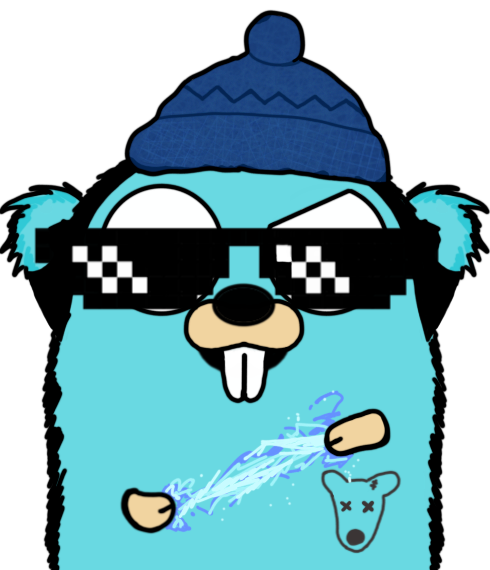

<div align="center">
    <a href="https://github.com/antontroskie" target="_blank">
        
    </a>
</div>

<div align="center">

</div>

## About

The objective of this project is to develop intuitive interfaces for Remote Procedure Calls (RPC) that emulate the
experience of invoking real functions and demand minimal setup.

### Features

- Seamlessly emulate the call pattern reminiscent of invoking genuine functions.
- Effortlessly generate client and service definitions directly from Golang code that boast thread safety, allowing
  seamless migration across various execution contexts.
- Adapt to diverse client and service configurations with ease.
- Leverage TCP-based communication for robust connectivity.

<div align="center">
    
</div>

[How to use guide](#how-to-use-this-project).

## How to use this project

- Clone this repository into your local machine.

```bash
    git clone https://github.com/antontroskie/radrpc.git
```

- Use `make help` to see available commands.

## Example

### Defining an RPC Interface

Suppose we have the following interface for a user service located at `./examples/userservice/userservice.go`

```golang
package userservice

type UserServiceRPC interface {
 CreateNewUser(name string, age int)
 GetUsers() []User
}

type UserService struct {
 users map[string]User
}

type User struct {
 Name string
 Age  int
}

func (u *UserService) CreateNewUser(name string, age int) {
 if u.users == nil {
  u.users = make(map[string]User)
 }
 u.users[name] = User{
  Name: name,
  Age:  age,
 }
}

func (u *UserService) GetUsers() []User {
 if u.users == nil {
  return []User{}
 }
 var users []User
 for _, user := range u.users {
  users = append(users, user)
 }
 return users
}
```

We can use the `generator` to create client and service definitions for the `UserServiceRPC` interface:

```bash
go run ./cmd/generator/main.go ./examples/userservice.UserServiceRPC
```

This will generate the following file, containing both client and service definitions:

```bash
./examples/userservice_rad_gen/userservice_rad_gen.go
```

### Create a Service and Client

Using the generated code, we create a new service and client to invoke the `CreateNewUser` and `GetUsers` methods
remotely:

#### Service

``` golang
package main

import (
 "time"

 userservice "github.com/antontroskie/radrpc/examples/userservice"
 userservicerad "github.com/antontroskie/radrpc/examples/userservice_rad_gen"
 rds "github.com/antontroskie/radrpc/pkg/rpc/service"
)

func main() {
 // Create a new service configuration
 serviceConfig := rds.RPCServiceConfig{
  Host:               ":8080",
  MaxConnections:     2,
  MaxRPCCallWaitTime: time.Second * 5,
  HeartbeatInterval:  time.Second * 1,
  MaxMessageRetries:  3,
  MaxConcurrentCalls: 5,
  UseTLS:             false,
 }

 // Create new service
 serviceRPC := userservicerad.NewUserServiceRPCRDService()

 // Create handler for the service
 handler := new(userservice.UserService)

 // Start the service with designated target
 if err := serviceRPC.StartService(handler, serviceConfig); err != nil {
  panic(err)
 }
}
```

#### Client

```golang
package main

import (
 "fmt"
 "time"

 userservicerad "github.com/antontroskie/radrpc/examples/userservice_rad_gen"
 rdc "github.com/antontroskie/radrpc/pkg/rpc/client"
)

func main() {
 // Create a new client configuration
 clientConfig := rdc.RPCClientConfig{
  Host:                    ":8080",
  MaxConnectionRetries:    0, // Retry indefinitely
  ConnectionRetryInterval: time.Second * 1,
  MaxRPCCallWaitTime:      time.Second * 5,
  UseTLS:                  false,
 }

 // Create new client
 clientRPC := userservicerad.NewUserServiceRPCRDClient()

 // Attempt to connect to the service
 rpcInterface, err := clientRPC.Connect(clientConfig)
 if err != nil {
  panic(err)
 }

 // Create a new user
 rpcInterface.CreateNewUser("Anton Troskie", 28)

 // Get all users
 users := rpcInterface.GetUsers()

 // Print users
 for _, user := range users {
  fmt.Printf("User: %v\n", user)
 }
}
```

### Restrictions

When using the `generator` to create client and service definitions, the following restrictions apply:

- The target interface must be defined in a file with the same name as the package.
- The target interface must contain methods that return a single value.
- The target interface must only contain function parameters and return values that are concrete types.
- The target interface must only have one implementation.

## Contributors

<a href="https://github.com/antontroskie/radrpc/graphs/contributors">
  
</a>

## Feedback

> You can make this project better, please feel free to open
> a [Pull Request](https://github.com/antontroskie/radrpc/pulls).

- If you notice a bug or a typo use the tag **"Correction"**.
- If you want to share any ideas to help make this project better, use the tag **"Enhancement"**.

<details>
    <summary>Contact Me 📨</summary>

### Contact

Reach me via email: [troskie.a@gmail.com](mailto:troskie.a@gmail.com)

</details>

## License

- [MIT License](./LICENSE)

<p align="right"><a href="#how-to-use-this-project">back to top ⬆️</a></p>
